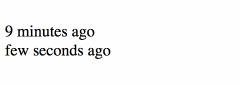

# jquery.liveTimeAgo.js

### A jQuery plugin to get "date ago" in realtime!


## Example : 



## How to use it

To use liveTimeAgo.js just understand this following lines :

#### Head :

```html
<script type="text/javascript" src="/path/to/jquery.min.js"></script>
<script type="text/javascript" src="/path/to/jquery.liveTimeAgo.min.js"></script>
```

#### Content :

```html
    <div class="liveTime">2016-06-20 14:44:00</div>
    <div class="liveTime" data-lta-value="2016-06-20 14:44:00"></div>
    <div class="liveTime" data-lta-type="timestamp" data-lta-value="1466431440"></div>
```

#### Launch :

```javascript
$('.liveTime').liveTimeAgo();
```


## Documentation

#### Browser compatibility :
* Firefox 
* Safari
* Chrome
* IE 8+
* Edge
* Opera
 
#### Date format :
* Datetime 
* Date
* Timestamp
 
#### Usages :

##### Datetime / Date : 

Default type is datetime/date so you have the choice to :

* put Datetime/Date value directly in your element
* add date value on "data-lta-value" attribute
* add date value on "data-lta-value" attribute and already step-up the right message in your element

```html
	<!-- With Datetime -->
    <div class="liveTime">2016-06-20 14:44:00</div>
    <div class="liveTime" data-lta-value="2016-06-20 14:44:00"></div>
    <div class="liveTime" data-lta-value="2016-06-20 14:44:00">2 months ago</div>
    
    <!-- With Date -->
    <div class="liveTime">2016-06-20</div>
    <div class="liveTime" data-lta-value="2016-06-20"></div>
    <div class="liveTime" data-lta-value="2016-06-20">2 months ago</div>
```

##### Timestamp : 

To use timestamp you need to specify the date's type with the "data-lta-type" attribute. Then you have same possibilies as datetime/date dates :

* put timestamp value directly in your element
* add timestamp value on "data-lta-value" attribute
* add timestamp value on "data-lta-value" attribute and already step-up the right message in your element

```html
	<!-- With timestamp -->
    <div class="liveTime" data-lta-type="timestamp"> 1466431440 </div>
    <div class="liveTime" data-lta-type="timestamp" data-lta-value="1466431440"></div>
    <div class="liveTime" data-lta-type="timestamp" data-lta-value="1466431440">2 months ago</div>
```


#### Options :

You can customize / translate the result:

(the % symbol represents the number of minutes, hours, days ... displayed)

```javascript
// This is the default translate array
var default_options = {
    translate: {
        'year': '% year ago',
        'years': '% years ago',
        'month':'% month ago',
        'months':'% months ago',
        'day': '% day ago',
        'days': '% days ago',
        'hour': '% hour ago',
        'hours': '% hours ago',
        'minute': '% minute ago',
        'minutes': '% minutes ago',
        'seconds': 'few seconds ago',
        'error': 'unknow time',
    }
};
$('.liveTime').liveTimeAgo(default_options);
```


## Contribute

We're always looking for:

* Bug reports, especially those for aspects with a reduced test case
* Pull requests for features, spelling errors, clarifications, etc.
* Ideas for enhancements


